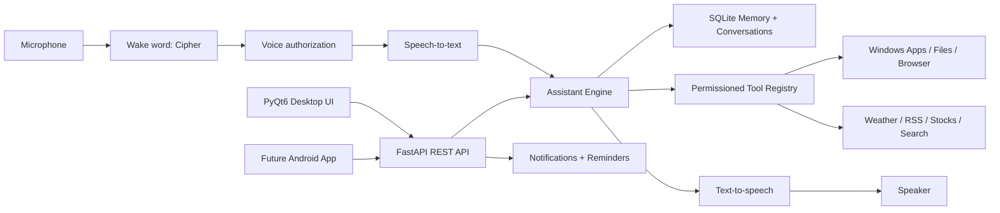

# JARVIS Architecture

## Design

JARVIS is split into isolated layers:

- `desktop`: PyQt6 system tray and desktop UI.
- `backend/api`: FastAPI endpoints for desktop and future Android clients.
- `backend/ai`: OpenAI Responses API orchestration, memory extraction, and prompt policy.
- `backend/tools`: structured tools plus a permission layer.
- `backend/voice`: wake word, voice auth, STT, and TTS adapters.
- `backend/db`: SQLite schema and repository classes.
- `backend/services`: daily briefing and notifications.

The backend binds to `127.0.0.1` by default. Keep it local unless you add authentication and TLS.

